# Use Cases · Reading Analytics Platform

**Versión:** 1.0
**Owner:** Celia (Founder / Product Owner)
**Fecha:** abril 2026
**Estado:** Ready for UX & Technical Design

---

## Índice

1. [Buscar y añadir un libro](#uc-01)
2. [Registrar estado de lectura](#uc-02)
3. [Actualizar progreso de lectura](#uc-03)
4. [Puntuar y etiquetar un libro](#uc-04)
5. [Gestionar TBR mensual](#uc-05)
6. [Definir y seguir meta anual](#uc-06)
7. [Ver estadísticas básicas](#uc-07)
8. [Importar datos históricos](#uc-08)
9. [Buscar y filtrar en la biblioteca](#uc-09)
10. [Exportar story de wrap-up](#uc-10)

---

## UC-01 · Buscar y añadir un libro

| Campo | Detalle |
|---|---|
| **ID** | UC-01 |
| **Nombre** | Buscar y añadir un libro |
| **Actor principal** | Lectora |
| **Prioridad** | MVP — Crítico |
| **Módulo** | Book Tracker |

### Descripción

La usuaria introduce un título o nombre de autora en el buscador. El sistema consulta las APIs de libros en orden de fallback, devuelve resultados enriquecidos con metadatos y la usuaria selecciona la edición deseada para guardarla en su biblioteca.

### Precondiciones

- La usuaria tiene sesión iniciada.
- Al menos una fuente de datos está disponible (Open Library o Google Books).

### Flujo principal

1. La usuaria accede a **Book Tracker** y pulsa **Añadir libro**.
2. Introduce un título o nombre de autora en el campo de búsqueda.
3. El sistema consulta **Open Library API** como fuente principal.
4. El sistema muestra los resultados con portada, título, autora, género, número de páginas e ISBN.
5. La usuaria selecciona la edición correcta.
6. El sistema guarda el libro en la biblioteca con sus metadatos.
7. El libro aparece visible en el tracker con estado por defecto **Pendiente**.

### Flujos alternativos

**3a · Open Library no devuelve resultados:**
El sistema realiza la consulta automáticamente a **Google Books API** como fallback y muestra los resultados obtenidos.

**3b · Ninguna API devuelve resultados:**
El sistema ofrece un formulario de **entrada manual** para que la usuaria introduzca los datos del libro.

**5a · La usuaria no encuentra la edición correcta:**
La usuaria puede editar los metadatos manualmente tras seleccionar el resultado más cercano.

### Postcondiciones

- El libro queda guardado en la biblioteca de la usuaria.
- Los metadatos están completos o parcialmente completados.
- El libro es visible en Book Tracker y en Home.

### Criterios de aceptación

- La búsqueda devuelve resultados relevantes.
- La usuaria puede seleccionar entre distintas ediciones.
- El guardado es correcto y el libro aparece en el tracker.
- El flujo completo (búsqueda → guardado) no supera 3 pasos activos para la usuaria.

### Diagrama UML

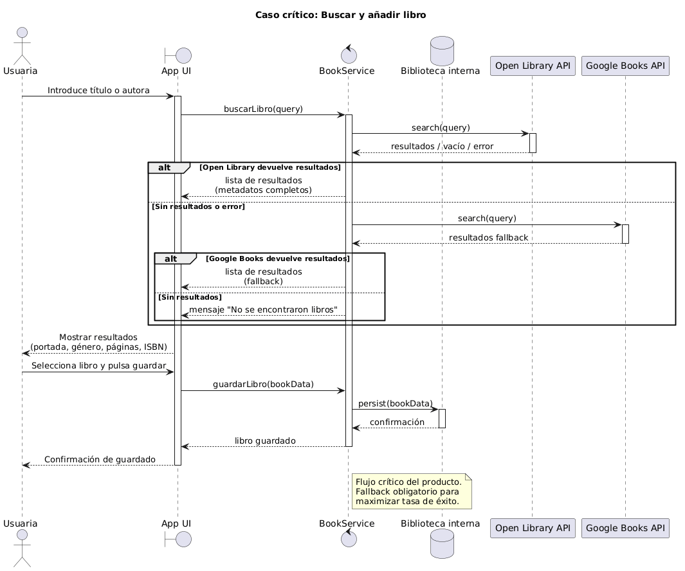

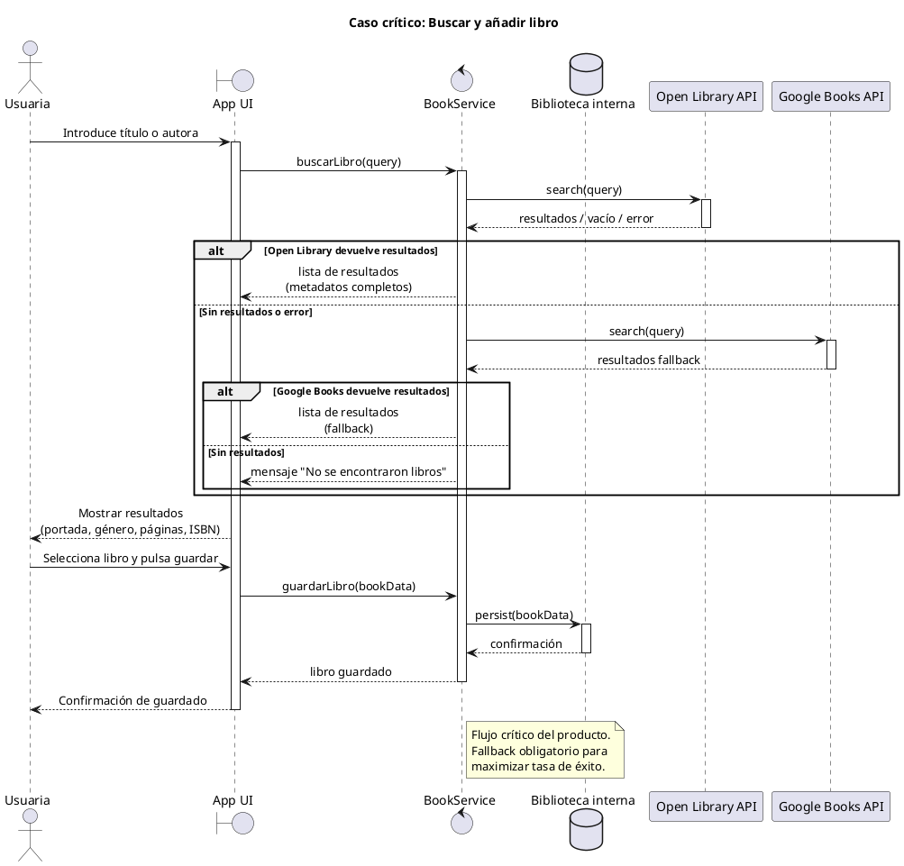

---

## UC-02 · Registrar estado de lectura

| Campo | Detalle |
|---|---|
| **ID** | UC-02 |
| **Nombre** | Registrar estado de lectura |
| **Actor principal** | Lectora |
| **Prioridad** | MVP — Crítico |
| **Módulo** | Book Tracker |

### Descripción

La usuaria asigna un estado de lectura a un libro de su biblioteca. El estado determina la presencia del libro en distintas secciones de la app y es la base de todas las estadísticas y el tracker.

### Precondiciones

- El libro existe en la biblioteca de la usuaria.

### Estados disponibles

| Estado | Descripción |
|---|---|
| `Leyendo` | Lectura activa en curso |
| `Leído` | Libro finalizado |
| `DNF` | Did Not Finish — lectura abandonada |
| `Pendiente` | En lista de espera, aún no iniciado |

### Flujo principal

1. La usuaria localiza el libro en **Book Tracker** o en **Home**.
2. Selecciona el estado deseado desde el selector de estado del libro.
3. El sistema actualiza el estado de forma inmediata.
4. El libro se mueve o aparece en las secciones correspondientes según el nuevo estado.

### Flujos alternativos

**3a · La usuaria marca el libro como `Leído`:**
El sistema activa automáticamente el flujo UC-04 (Puntuar y etiquetar) mediante un modal de finalización.

**3b · El libro pertenece al TBR mensual activo:**
Al marcarlo como `Leído`, el sistema lo marca automáticamente como completado en la lista TBR (ver UC-05).

### Postcondiciones

- El estado del libro queda actualizado en la base de datos.
- Las estadísticas y KPIs se recalculan para reflejar el nuevo estado.
- El libro aparece en la sección correspondiente a su estado.

### Criterios de aceptación

- El cambio de estado es inmediato y visible sin recargar la página.
- Un libro en estado `Leyendo` aparece en Home y en el tracker activo.
- Un libro en estado `Leído` computa en estadísticas y meta anual.

### Diagrama UML

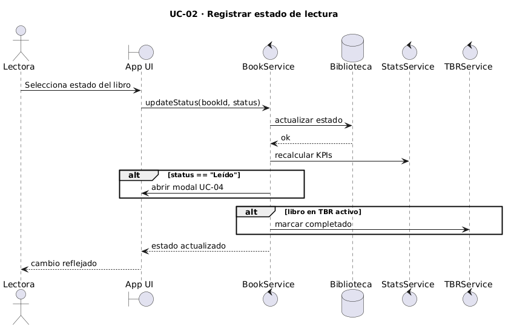

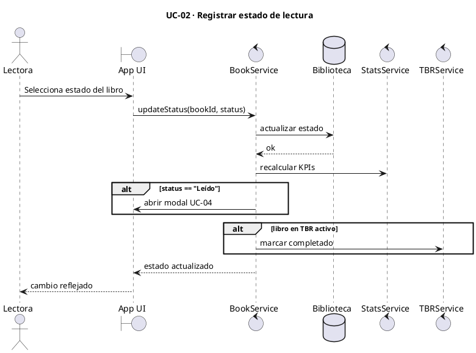

---

## UC-03 · Actualizar progreso de lectura

| Campo | Detalle |
|---|---|
| **ID** | UC-03 |
| **Nombre** | Actualizar progreso de lectura |
| **Actor principal** | Lectora |
| **Prioridad** | Alta — V1 |
| **Módulo** | Book Tracker / Home |

### Descripción

La usuaria introduce la página en la que se encuentra actualmente. El sistema calcula el porcentaje de avance y lo muestra visualmente mediante una barra de progreso.

### Precondiciones

- El libro tiene estado `Leyendo`.
- El libro tiene número de páginas registrado en sus metadatos.

### Flujo principal

1. La usuaria accede a **Home** o a **Book Tracker**.
2. Localiza el libro en lectura activa.
3. Introduce la página actual en el campo de progreso (edición inline).
4. El sistema calcula el porcentaje: `(página actual / total páginas) × 100`.
5. La barra de progreso se actualiza visualmente de forma inmediata.

### Flujos alternativos

**4a · El libro no tiene número de páginas registrado:**
El sistema solicita que la usuaria introduzca el total de páginas antes de poder calcular el porcentaje.

**4b · La página introducida es mayor que el total de páginas:**
El sistema muestra un aviso de validación e impide guardar el valor.

### Postcondiciones

- El progreso queda guardado y asociado al libro.
- La barra de progreso refleja el porcentaje actualizado.
- El dato está disponible para las estadísticas de sesión de lectura.

### Criterios de aceptación

- La edición del campo de página es inline, sin necesidad de abrir modal.
- El porcentaje calculado es correcto.
- La barra de progreso se actualiza sin recargar la página.

### Diagrama UML

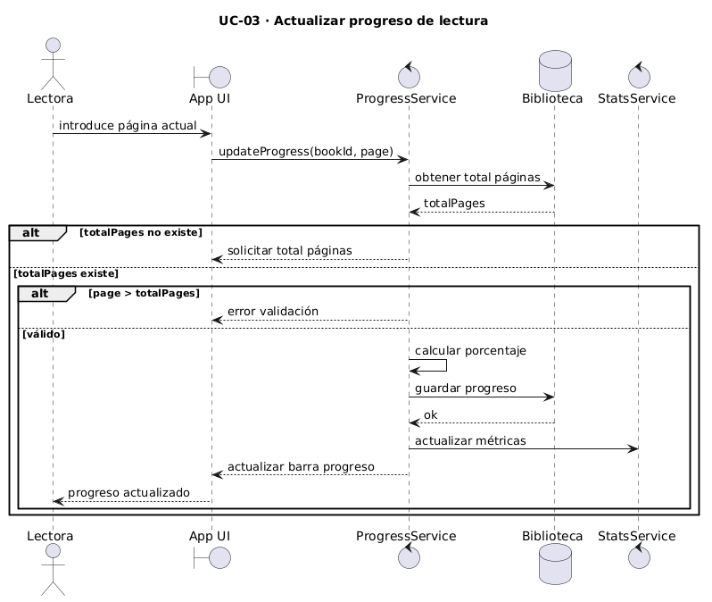

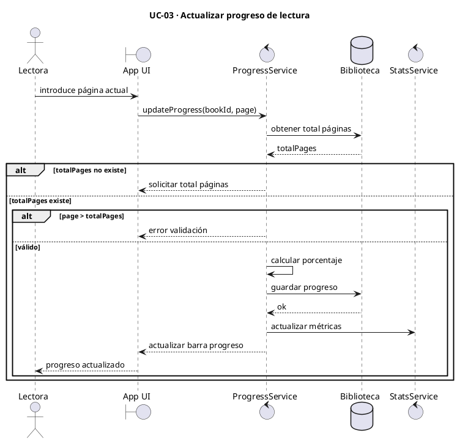

---

## UC-04 · Puntuar y etiquetar un libro

| Campo | Detalle |
|---|---|
| **ID** | UC-04 |
| **Nombre** | Puntuar y etiquetar un libro |
| **Actor principal** | Lectora |
| **Prioridad** | MVP — Crítico |
| **Módulo** | Book Tracker |

### Descripción

Al marcar un libro como `Leído`, la usuaria puede enriquecer el registro con rating, fecha de finalización, formato de lectura y tags personalizadas. Estos datos alimentan todos los dashboards y estadísticas de la plataforma.

### Precondiciones

- El libro existe en la biblioteca.
- La usuaria ha marcado el libro como `Leído` (puede desencadenarse desde UC-02).

### Flujo principal

1. El sistema abre un modal de finalización al cambiar el estado a `Leído`.
2. La usuaria introduce o confirma la **fecha de fin** (por defecto: hoy).
3. La usuaria selecciona el **formato** de lectura: Físico, Ebook o Audio.
4. La usuaria asigna un **rating** de 1 a 5 estrellas.
5. La usuaria añade una o varias **tags** (géneros, tropos u otras etiquetas personalizadas).
6. La usuaria guarda el registro.
7. El sistema actualiza las estadísticas con los nuevos datos.

### Flujos alternativos

**5a · La usuaria quiere crear una nueva tag:**
Puede escribir el nombre de la nueva tag directamente en el campo. El sistema la crea y la añade al catálogo de tags personalizadas de la usuaria.

**6a · La usuaria cierra el modal sin guardar:**
El libro queda en estado `Leído` pero sin rating, formato ni tags. La usuaria puede completar estos campos más adelante desde la vista de detalle del libro.

### Postcondiciones

- El libro tiene rating, formato y tags almacenados.
- Las estadísticas (rating medio, distribución por formato, géneros más leídos) se actualizan.
- Las tags quedan disponibles para búsqueda y filtrado en la biblioteca.

### Criterios de aceptación

- El modal se activa automáticamente al marcar un libro como `Leído`.
- El rating se puede asignar mediante estrellas interactivas.
- Las tags personalizadas se pueden crear directamente desde el modal.
- Los datos quedan reflejados en los dashboards de estadísticas.

### Diagrama UML

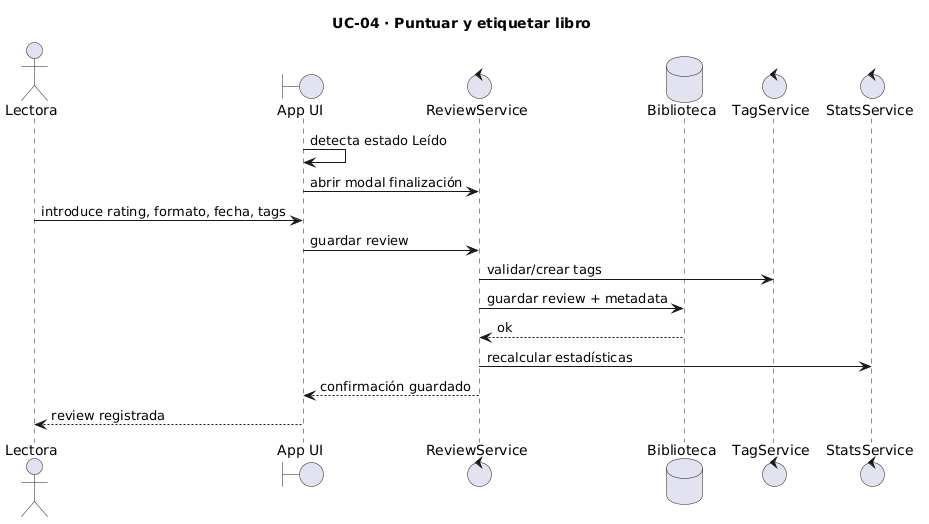

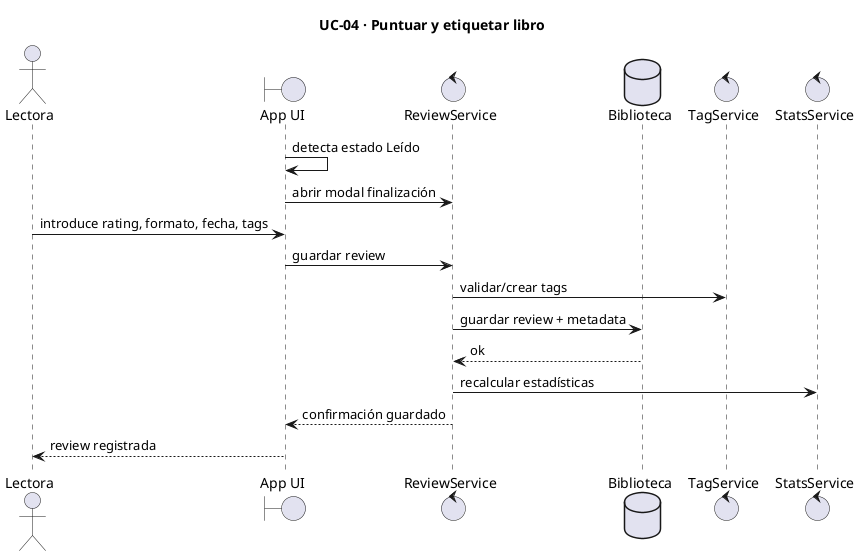

---

## UC-05 · Gestionar TBR mensual

| Campo | Detalle |
|---|---|
| **ID** | UC-05 |
| **Nombre** | Gestionar TBR mensual |
| **Actor principal** | Lectora |
| **Prioridad** | MVP — Alto |
| **Módulo** | Lists |

### Descripción

La usuaria crea y gestiona sus listas TBR (To Be Read) **por mes**: añade libros, los reordena por prioridad mediante drag & drop y el sistema los marca automáticamente como completados cuando pasan a estado `Leído`. Puede **editar en cualquier momento del año** cualquier TBR (pasado, en curso o futuro) y **todos los datos** de esa lista, sin obligación de llevar el seguimiento en tiempo real.

La lista de un mes **no tiene por existir hasta que haga falta**. Si aún no existe, el sistema puede **crearla automáticamente el día anterior al inicio de ese mes**; si la usuaria **ya la creó a mano** (en cualquier fecha, incluso con antelación), **no** se vuelve a crear por el proceso automático. La usuaria puede **crear manualmente** el TBR de cualquier mes cuando quiera (por ejemplo, **planificar de una vez los 12 meses** del año siguiente).

### Precondiciones

- La usuaria tiene sesión iniciada.
- Para añadir entradas con libros ya catalogados, conviene tener esos libros en la biblioteca (con cualquier estado); si no, aplica el flujo de alta desde búsqueda (UC-01).

### Flujo principal

1. La usuaria accede a **Lists** y elige el **TBR mensual** del mes que desea (actual u otro mediante navegación por mes/año).
2. Si ese mes **aún no tiene lista**, puede **crearla manualmente** en el acto; en caso contrario, si llega el **día anterior al inicio de ese mes** y la lista **sigue sin existir**, el sistema **crea una lista vacía** automáticamente. Si la lista **ya existe** (por creación manual previa), el sistema **no** duplica ni sobrescribe.
3. La usuaria añade libros a la lista desde la búsqueda o desde su biblioteca.
4. La usuaria reordena los libros por prioridad mediante **drag & drop**.
5. A medida que lee, los libros marcados como `Leído` se marcan automáticamente como completados en la lista cuando corresponda (p. ej. si el libro está en el TBR del mes en curso; ver UC-02).

### Flujos alternativos

**2a · Planificación anticipada:** La usuaria crea manualmente los TBR de uno o varios meses futuros (p. ej. los doce del año siguiente). Esas listas quedan persistidas; cuando llegue el día anterior a cada mes, **no** se ejecutará creación automática porque el TBR ya existe.

**2b · Retraso o ajuste sobre meses pasados:** La usuaria abre un **mes anterior** y **edita libros, orden y cualquier dato** de la lista para alinearla con lo que realmente leyó o con cómo quiere documentarlo a posteriori.

**3a · El libro no está en la biblioteca:**
La usuaria puede buscarlo y añadirlo directamente a la biblioteca y al TBR en el mismo flujo (desencadena UC-01).

### Postcondiciones

- El TBR del mes consultado refleja los libros seleccionados y su orden de prioridad (tras guardar cambios).
- Los libros completados aparecen visualmente diferenciados (tachados o con check).
- El progreso del TBR es visible desde Home.
- Las listas de meses pasados **permanecen editables**; no hay cierre definitivo por calendario.

### Criterios de aceptación

- Para cada mes, **como mucho existe un** TBR mensual; si la usuaria ya lo creó a mano, el job o regla automática del **día anterior al inicio del mes** **no** crea otro.
- Si un mes **no** tiene TBR cuando llega ese día previo al inicio del mes, el sistema **crea** el TBR vacío automáticamente.
- La usuaria puede **crear manualmente** el TBR de **cualquier** mes en **cualquier** momento (incluida la planificación de varios meses o de un año completo).
- **Cualquier** TBR (pasado, presente o futuro) admite **edición completa** de sus datos en cualquier momento del año.
- El drag & drop funciona correctamente para reordenar.
- Al marcar un libro como `Leído`, se marca automáticamente como completado en el TBR cuando aplique la misma regla que en UC-02 (p. ej. TBR mensual activo).

### Diagrama UML

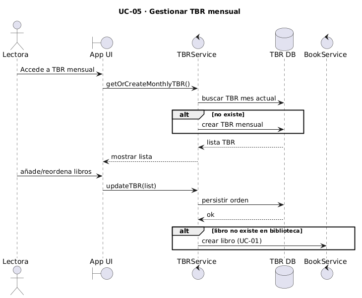

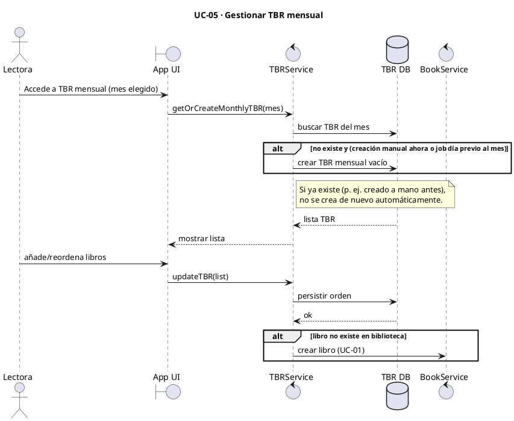

---

## UC-06 · Definir y seguir meta anual

| Campo | Detalle |
|---|---|
| **ID** | UC-06 |
| **Nombre** | Definir y seguir meta anual |
| **Actor principal** | Lectora |
| **Prioridad** | MVP — Alto |
| **Módulo** | Goals / Home |

### Descripción

La usuaria establece un objetivo numérico de libros a leer durante el año. El sistema realiza un seguimiento continuo mostrando el progreso actual, el porcentaje completado y un forecast del ritmo necesario para alcanzar la meta.

### Precondiciones

- La usuaria tiene sesión iniciada.
- Existe al menos un libro registrado con estado `Leído` para que el progreso sea visible.

### Flujo principal

1. La usuaria accede a **Goals** o al widget de meta en **Home**.
2. Introduce el número de libros que quiere leer en el año.
3. El sistema guarda la meta y muestra:
   - Libros leídos hasta la fecha.
   - Porcentaje de progreso sobre la meta.
   - Forecast: ritmo actual vs. ritmo necesario para cumplir la meta.
4. La meta se actualiza automáticamente cada vez que se añade un libro con estado `Leído`.
5. La usuaria puede editar la meta en cualquier momento.

### Flujos alternativos

**3a · La usuaria va por delante del ritmo necesario:**
El sistema muestra un indicador positivo de que va adelantada respecto al objetivo.

**3b · La usuaria va por detrás del ritmo necesario:**
El sistema muestra el número de libros adicionales por semana/mes necesarios para alcanzar la meta.

### Postcondiciones

- La meta queda guardada y asociada al año en curso.
- El widget de Home refleja el progreso actualizado.
- El forecast se recalcula automáticamente tras cada nuevo libro `Leído`.

### Criterios de aceptación

- El porcentaje de progreso es correcto y se actualiza en tiempo real.
- El forecast es coherente con el ritmo de lectura real de la usuaria.
- La meta es editable en cualquier momento del año.

### Diagrama UML

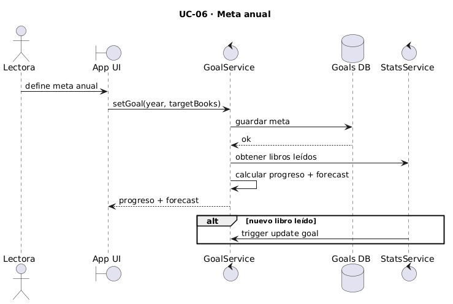

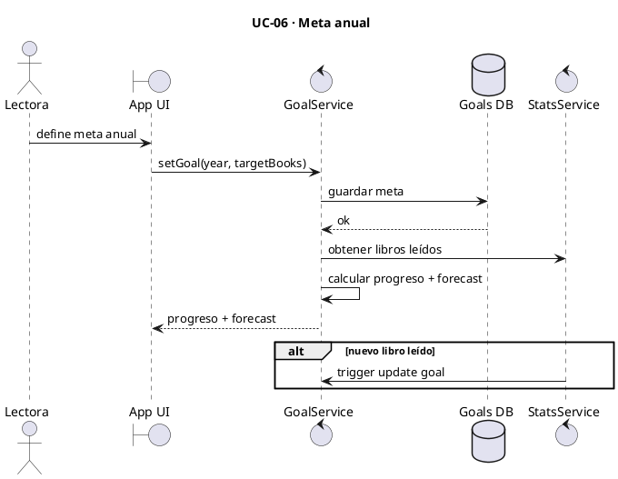

---

## UC-07 · Ver estadísticas básicas

| Campo | Detalle |
|---|---|
| **ID** | UC-07 |
| **Nombre** | Ver estadísticas básicas |
| **Actor principal** | Lectora |
| **Prioridad** | MVP — Crítico |
| **Módulo** | Reading Stats / Home |

### Descripción

La usuaria accede al dashboard de estadísticas donde visualiza los KPIs clave del periodo seleccionado: libros leídos, páginas totales, rating medio, géneros más leídos y formato predominante.

### Precondiciones

- La usuaria tiene al menos un libro con estado `Leído` en el periodo consultado.

### Flujo principal

1. La usuaria accede a **Reading Stats** o visualiza los KPIs en **Home**.
2. El sistema calcula y muestra los siguientes indicadores para el mes en curso:
   - Número de libros leídos.
   - Total de páginas leídas.
   - Rating medio de los libros puntuados.
   - Distribución por género (gráfico).
   - Formato predominante (Físico / Ebook / Audio).
3. La usuaria puede cambiar el periodo (mes anterior, año, rango personalizado).
4. El sistema recalcula los indicadores para el periodo seleccionado.

### Flujos alternativos

**4a · La usuaria quiere comparar dos periodos:**
Puede activar la vista de comparativa para ver ambos periodos en paralelo (funcionalidad V1).

### Postcondiciones

- Los gráficos y KPIs reflejan fielmente los datos registrados.
- La usuaria puede navegar entre distintos periodos sin perder el contexto visual.

### Criterios de aceptación

- Los KPIs son correctos y coherentes con los libros registrados.
- Los gráficos son claros y legibles.
- El cambio de periodo actualiza todos los indicadores de forma simultánea.
- Se generan al menos 3 insights automáticos por periodo.

### Diagrama UML

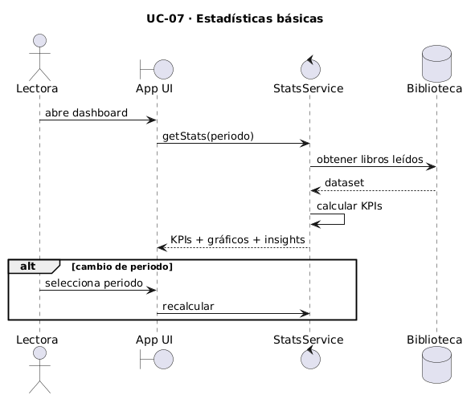

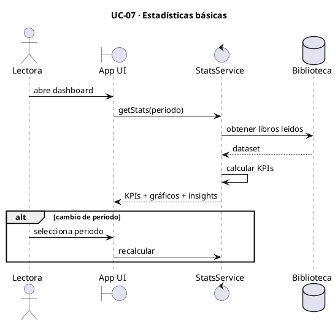

---

## UC-08 · Importar datos históricos

| Campo | Detalle |
|---|---|
| **ID** | UC-08 |
| **Nombre** | Importar datos históricos |
| **Actor principal** | Lectora |
| **Prioridad** | MVP — Crítico (KPI de activación principal) |
| **Módulo** | Import / Export |

### Descripción

La usuaria sube su historial de lecturas desde un archivo CSV o desde la exportación de Goodreads para trasladar todos sus datos históricos a la plataforma sin necesidad de introducirlos manualmente.

### Precondiciones

- La usuaria dispone de un archivo CSV válido o de la exportación de su cuenta de Goodreads.

### Formatos soportados

| Formato | Fuente |
|---|---|
| `.csv` | Excel, Notion u otras herramientas |
| Exportación Goodreads | Archivo CSV generado desde Goodreads |

### Flujo principal

1. La usuaria accede a **Import / Export** y selecciona la opción de importación.
2. Selecciona el tipo de archivo: CSV genérico o exportación de Goodreads.
3. Sube el archivo desde su dispositivo.
4. El sistema valida el formato y muestra una previsualización de los datos a importar.
5. La usuaria confirma la importación.
6. El sistema procesa el archivo, mapea los campos y crea los registros en la biblioteca.
7. El sistema notifica el resultado: registros importados, duplicados detectados y errores.

### Flujos alternativos

**4a · El archivo tiene errores de formato:**
El sistema muestra los errores concretos e indica a la usuaria cómo corregirlos antes de volver a intentarlo.

**6a · Se detectan libros duplicados:**
El sistema alerta sobre los duplicados y permite a la usuaria elegir si sobreescribir o ignorarlos.

### Postcondiciones

- Los libros históricos están disponibles en la biblioteca con sus metadatos.
- Las estadísticas históricas son visibles en los dashboards.
- El KPI de activación (importación + uso semanal continuado) puede comenzar a medirse.

### Criterios de aceptación

- El sistema acepta archivos CSV estándar y el formato de exportación de Goodreads.
- La previsualización es clara antes de confirmar la importación.
- Los errores se comunican de forma específica y accionable.
- Los registros importados aparecen correctamente en la biblioteca y en las estadísticas.

### Diagrama UML

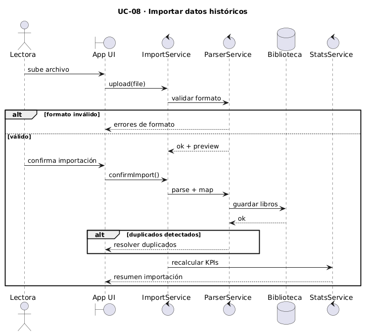

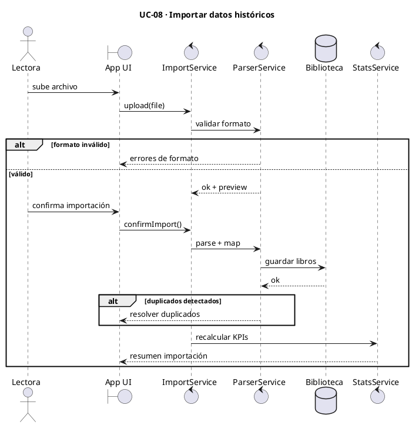

---

## UC-09 · Buscar y filtrar en la biblioteca

| Campo | Detalle |
|---|---|
| **ID** | UC-09 |
| **Nombre** | Buscar y filtrar en la biblioteca |
| **Actor principal** | Lectora |
| **Prioridad** | Alta — V1 |
| **Módulo** | Library / Book Tracker |

### Descripción

La usuaria aplica filtros o realiza búsquedas de texto libre dentro de su biblioteca completa para localizar libros concretos a medida que su catálogo crece.

### Precondiciones

- La usuaria tiene libros registrados en su biblioteca.

### Filtros disponibles

| Dimensión | Valores posibles |
|---|---|
| Autora | Texto libre |
| Género | Lista de géneros registrados |
| Rating | 1–5 estrellas |
| Año de lectura | Año numérico |
| Formato | Físico / Ebook / Audio |
| Tag | Tags personalizadas de la usuaria |
| Estado | Leído / Leyendo / DNF / Pendiente |

### Flujo principal

1. La usuaria accede a **Library** o a **Book Tracker**.
2. Introduce texto en la barra de búsqueda o selecciona uno o varios filtros.
3. El sistema filtra los resultados en tiempo real.
4. La usuaria puede combinar múltiples filtros simultáneamente.
5. Los filtros aplicados permanecen activos durante la sesión (filtros persistentes).

### Flujos alternativos

**3a · La búsqueda no devuelve resultados:**
El sistema muestra un mensaje claro indicando que no hay resultados y sugiere ampliar o modificar los filtros.

### Postcondiciones

- Los resultados mostrados corresponden exactamente a los filtros aplicados.
- Los filtros se mantienen activos al navegar dentro de la misma sección.

### Criterios de aceptación

- El filtrado es en tiempo real, sin necesidad de confirmar con un botón.
- Se pueden combinar múltiples filtros a la vez.
- Los filtros son persistentes durante la sesión.
- La búsqueda por texto libre funciona sobre título, autora y tags.

### Diagrama UML

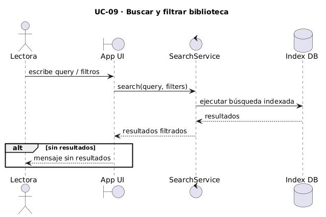

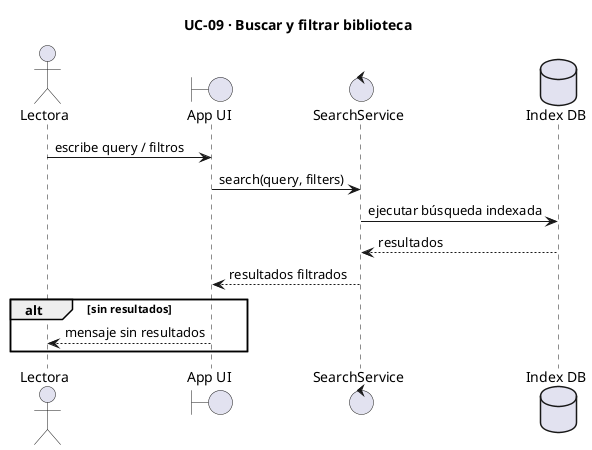

---

## UC-10 · Exportar story de wrap-up

| Campo | Detalle |
|---|---|
| **ID** | UC-10 |
| **Nombre** | Exportar story de wrap-up |
| **Actor principal** | Lectora / Influencer literaria |
| **Prioridad** | Alta — V1 |
| **Módulo** | Recap / Insights · Import / Export |

### Descripción

La usuaria genera una imagen vertical en formato 9:16 con las estadísticas del mes o del año, lista para compartir en stories de Instagram o TikTok. Es la funcionalidad diferencial para el perfil de influencer literaria y el principal vector de viralidad orgánica del producto.

### Precondiciones

- La usuaria tiene al menos un libro con estado `Leído` en el periodo a exportar.

### Flujo principal

1. La usuaria accede a **Recap / Insights** o a **Import / Export**.
2. Selecciona el tipo de wrap-up: mensual o anual.
3. Selecciona el periodo concreto (mes y año, o año).
4. El sistema genera una previsualización del story con:
   - Libros leídos en el periodo.
   - Páginas totales.
   - Rating medio.
   - Género más leído.
   - Portadas de los libros leídos (si están disponibles).
5. La usuaria descarga la imagen en formato **PNG** o **PDF**.

### Flujos alternativos

**4a · Alguna portada no está disponible:**
El sistema muestra un placeholder visual coherente con la estética de la app en lugar de la portada.

**5a · La usuaria quiere personalizar el contenido del story:**
Puede seleccionar qué estadísticas mostrar u ocultar antes de generar la imagen final.

### Postcondiciones

- La imagen generada está en formato vertical 9:16.
- La imagen es legible en dispositivo móvil.
- El archivo descargado es de calidad suficiente para publicación en redes sociales.

### Criterios de aceptación

- El formato de salida es 9:16 (vertical, orientado a stories).
- El diseño es visualmente atractivo y coherente con la estética del producto.
- La imagen es legible en pantalla de móvil.
- La descarga funciona en PNG y PDF.
- El flujo completo (selección de periodo → descarga) no supera 3 pasos.

### Diagrama UML

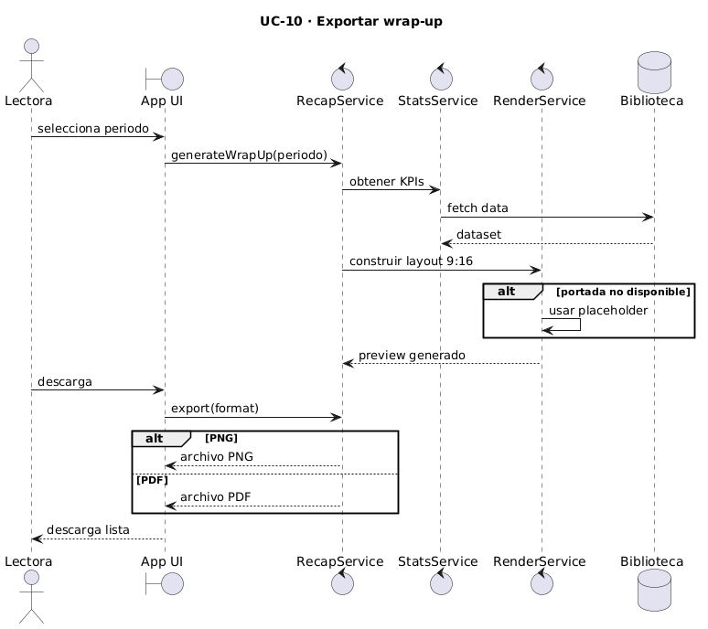

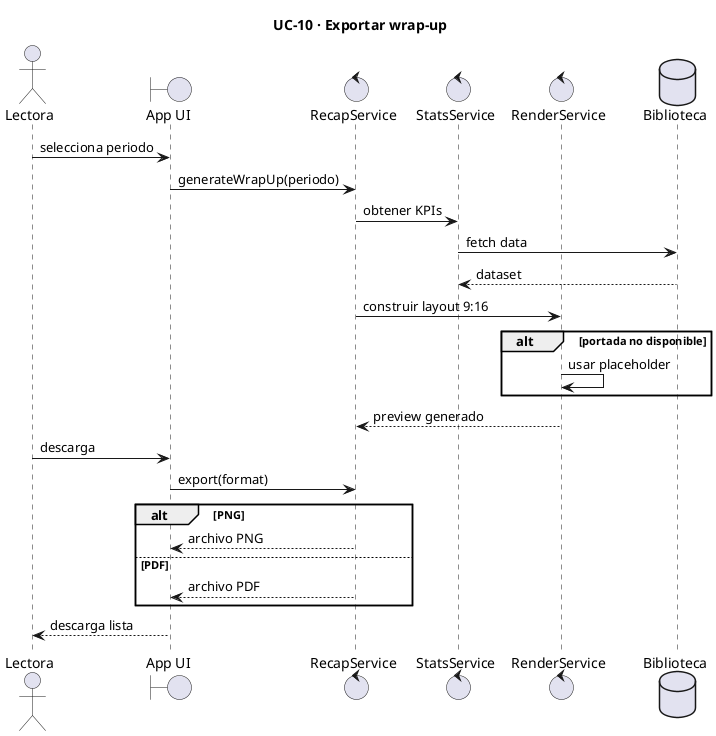

---

*Documento generado en abril 2026 · Reading Analytics Platform v1.0*
