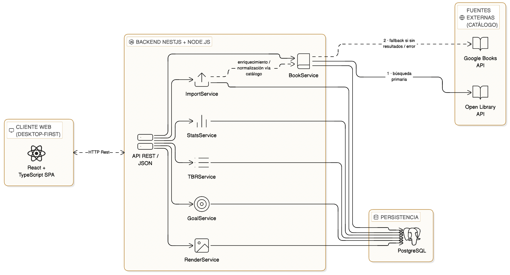
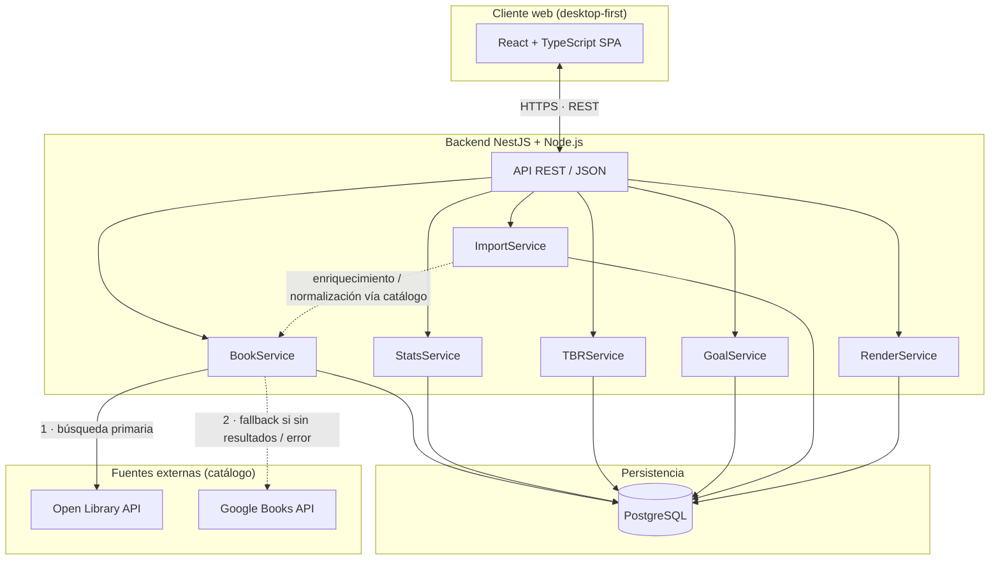
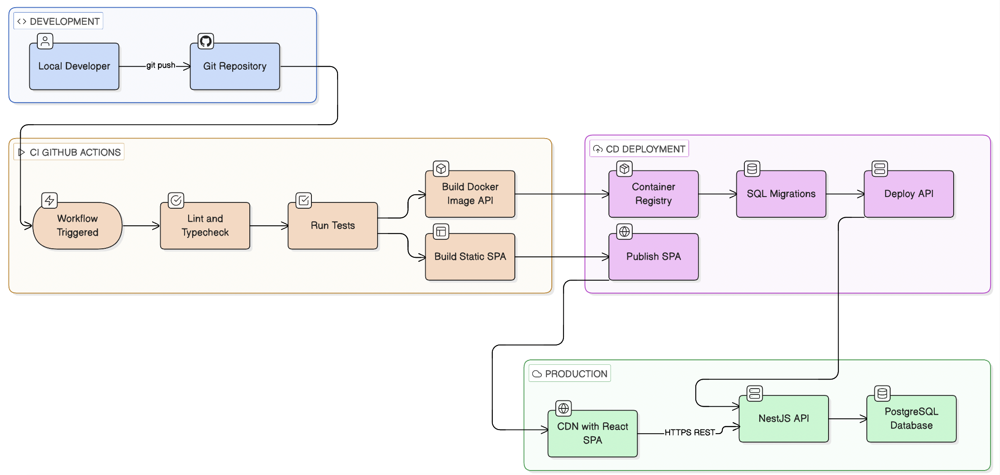
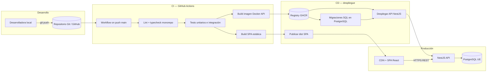

## Índice

0. [Ficha del proyecto](#0-ficha-del-proyecto)
1. [Descripción general del producto](#1-descripción-general-del-producto)
2. [Arquitectura del sistema](#2-arquitectura-del-sistema)
3. [Modelo de datos](#3-modelo-de-datos)
4. [Especificación de la API](#4-especificación-de-la-api)
5. [Historias de usuario](#5-historias-de-usuario)
6. [Tickets de trabajo](#6-tickets-de-trabajo)
7. [Pull requests](#7-pull-requests)

---

## 0. Ficha del proyecto

### **0.1. Tu nombre completo:**
Celia Merino Valladolid

### **0.2. Nombre del proyecto:**

### **0.3. Descripción breve del proyecto:**

### **0.4. URL del proyecto:**

> Puede ser pública o privada, en cuyo caso deberás compartir los accesos de manera segura. Puedes enviarlos a [alvaro@lidr.co](mailto:alvaro@lidr.co) usando algún servicio como [onetimesecret](https://onetimesecret.com/).

### 0.5. URL o archivo comprimido del repositorio

> Puedes tenerlo alojado en público o en privado, en cuyo caso deberás compartir los accesos de manera segura. Puedes enviarlos a [alvaro@lidr.co](mailto:alvaro@lidr.co) usando algún servicio como [onetimesecret](https://onetimesecret.com/). También puedes compartir por correo un archivo zip con el contenido


---

## 1. Descripción general del producto

**Reading Analytics Platform** es una aplicación web orientada a escritorio (desktop-first) para lectoras intensivas que quieren registrar lecturas y obtener estadísticas avanzadas de forma visual, sencilla y automatizada. Sustituye el uso de Excel como herramienta de seguimiento, elimina fórmulas manuales y reduce la entrada repetitiva de datos. El foco es la **analítica de libros leídos**: no es una red social, sino un espacio personal con dashboards, comparativas y objetivos.

### **1.1. Objetivo:**

**Propósito:** permitir que lectoras orientadas a datos registren lecturas con poca fricción, gestionen TBR mensuales, analicen métricas mensuales y anuales, sigan una meta anual, exporten visuales atractivos y descubran patrones en sus hábitos.

**Valor y problema que resuelve:** centraliza el tracking lector y la analítica en un solo producto, con captura de metadatos automatizada (frente a hojas de cálculo) y estadísticas pensadas para quienes ya disfrutan analizando patrones.

**Para quién:** lectoras que leen varios libros al mes y suelen usar Excel o Notion; como caso secundario, perfiles que quieren wrap-ups y estadísticas visuales para contenido (por ejemplo Instagram o TikTok).

### **1.2. Características y funcionalidades principales:**

- **Registro y seguimiento de lecturas:** añadir libros con búsqueda que enriquece metadatos (con fallback entre fuentes: Open Library, Google Books, Goodreads y entrada manual); progreso por página o porcentaje; lecturas simultáneas.
- **Home:** vista con libros en curso, progreso, meta anual, KPIs del mes y TBR actual.
- **Book Tracker:** tabla visual, filtros, búsqueda interna, edición y altas.
- **Reading Stats:** dashboards, gráficos, comparativas e insights.
- **Listas y TBR:** TBR mensual, listas personalizadas, favoritos y retos; apoyo a flujos tipo drag and drop (según diseño).
- **Goals:** meta anual, forecast y evolución.
- **Biblioteca (Library):** histórico completo con búsqueda avanzada y filtros (autora, género, trope, saga, año, formato, rating, etc.).
- **Recap / Insights:** resúmenes mensuales y anuales; exportación.
- **Import / Export:** Excel, CSV, export de Goodreads; export en PNG, PDF y formato story 9:16.
- **Tags personalizados:** etiquetas propias (por ejemplo géneros de nicho o book club).
- **Perfil y ajustes:** preferencias, temas visuales, fuentes de datos y objetivos.

**Prioridades de producto (referencia PRD):** MVP centrado en alta automática de libros, listas TBR, meta anual e insights automáticos; en evolución, comparativas, export story, búsqueda avanzada y tags.

### **1.3. Diseño y experiencia de usuario:**

**Estilo:** línea visual *soft feminine / coquette*: elegante, suave, cálida y limpia, más cercana a una app de journaling o *reading planner* que a un SaaS corporativo.

**Navegación:** barra lateral fija a la izquierda que da acceso a Home, Book Tracker, Reading Stats, Listas, Goals, Library, Recap/Insights, Import/Export y Perfil/Ajustes.

**Principios de interfaz:** tarjetas con bordes redondeados, tipografía editorial, dashboards y gráficos claros, microinteracciones y edición inline, modales y filtros persistentes donde aplique.

**Paleta (referencia):** Veranda blue `#6BB1AD` (primarios y navegación), Sky cloud `#A7BCBD` (secundarios), blanco `#FFFFFF` (fondo), Lychee `#ECECDB` (cards/modales), Melon `#E5A9A9` (highlights), Cupid pink `#E6748E` (KPIs y acentos).

**Accesibilidad:** cumplimiento orientado a la normativa española (Ley 11/2023, RD 193/2023) y estándar UNE-EN 301 549 alineado con WCAG 2.1/2.2 nivel AA.


### **1.4. Instrucciones de instalación:**

Stack previsto: **frontend** React y TypeScript; **backend** Node.js con NestJS; **base de datos** PostgreSQL. Los pasos concretos (`package.json`, scripts, migraciones y semillas) dependerán del repositorio cuando el código esté en el árbol; como guía típica en local:

1. **Requisitos:** Node.js (LTS), npm o pnpm, PostgreSQL instalado o vía Docker, y Git.
2. **Base de datos:** crear una base y un usuario; configurar la URL en un archivo `.env` del backend (por ejemplo `DATABASE_URL` o variables que use TypeORM/Prisma según se elija).
3. **Backend:** clonar el repositorio, entrar en la carpeta del API, instalar dependencias, ejecutar migraciones y, si existen, semillas (`npm install`, `npm run migration:run`, `npm run seed`, u homólogos).
4. **Frontend:** en la carpeta del cliente, instalar dependencias y arrancar en desarrollo (`npm install`, `npm run dev` o `npm start`), apuntando la URL del API en variables de entorno (por ejemplo `VITE_*` o `REACT_APP_*`).
5. **Servicios externos (opcional):** claves para Open Library / Google Books si el backend las requiere para cuotas o configuración.

---

## 2. Arquitectura del Sistema

### **2.1. Diagrama de arquitectura**

La plataforma sigue un modelo **cliente-servidor**: una SPA en el navegador consume una **API REST** stateless; el backend concentra la lógica de negocio por dominios (alineados con los casos de uso del [PRD](PRD.md) y [`documents/use-cases.md`](documents/use-cases.md)); **PostgreSQL** es la fuente de verdad para biblioteca, lecturas, listas, metas y agregados analíticos. La resolución de metadatos de libros pasa por **Open Library** primero y **Google Books** en **fallback secuencial** (UC-01).





**Patrón arquitectónico.** Se adopta un **monolito modular por capas** en el backend (NestJS: módulos + providers inyectables), expuesto como **API REST**. El frontend es una **SPA** que orquesta vistas ricas (dashboards, tablas, export) sin lógica de persistencia propia.

Encaja con el producto porque: (1) **desktop-first** y **sin red social** no exigen fan-out en tiempo real ni grafos de relaciones entre usuarias: el tráfico es petición-respuesta y lecturas/escrituras acotadas a la sesión de una usuaria. (2) **Analytics-heavy** se resuelve bien con **consultas y jobs sobre un único esquema relacional** coherente (StatsService y agregados derivados de libros y eventos de lectura), evitando la complejidad operativa de sincronizar microservicios para métricas que deben ser consistentes entre Home, Reading Stats y Goals. (3) Los **servicios nombrados** mapean directamente a capacidades del PRD y UC: libros y estados (BookService), KPIs y series temporales (StatsService), TBR mensual (TBRService), meta anual y forecast (GoalService), ingestas Excel/CSV/Goodreads (ImportService), artefactos visuales PNG/PDF/story (RenderService).

**Beneficios principales para el proyecto**

1. **Una fuente de verdad y analítica coherente:** todo el historial de lectura y las listas viven en PostgreSQL; las mismas reglas alimentan tracker, estadísticas, TBR y metas, reduciendo discrepancias entre pantallas.
2. **Coste cognitivo y de despliegue bajos para el alcance MVP:** un solo despliegue backend, trazabilidad clara UC → módulo/servicio, y tests de integración contra una base de datos real sin orquestación distribuida.
3. **Encapsulación de integraciones frágiles:** el fallback Open Library → Google Books queda acotado al dominio de catálogo (BookService); el resto de la API no depende del contrato concreto de cada proveedor externo.

**Sacrificios y limitaciones**

1. **Escalado horizontal del monolito:** si el volumen de usuarias o de informes pesados crece, el mismo proceso sirve API y trabajos costosos (p. ej. RenderService); puede hacer falta extraer colas/workers o instancias dedicadas sin rediseñar el modelo de datos.
2. **Acoplamiento a disponibilidad y cuotas de terceros:** caídas o límites de Open Library / Google Books degradan el alta de libros; hace falta caché, reintentos y entrada manual (UC-01) como válvula de escape ya prevista en producto.
3. **SPA + REST:** la primera carga y la hidratación de dashboards pueden ser más pesadas que un enfoque multipágina server-rendered; se compensa con buen code splitting y endpoints de agregación pensados para no multiplicar round-trips innecesarios.

### **2.2. Descripción de componentes principales:**

La aplicación se organiza en **capas** sobre un **monolito modular NestJS** y una **SPA React**. La tabla siguiente resume responsabilidades, tecnología y dependencias; después se detallan los **servicios de dominio** alineados con el PRD y los UC.

#### Capas transversales

| Componente | Responsabilidad | Tecnología | Dependencias clave |
| --- | --- | --- | --- |
| **Capa de presentación (SPA)** | Rutas y vistas por módulo de producto (Home, Book Tracker, Reading Stats, Lists/TBR, Goals, Library, Recap/Insights, Import/Export, Perfil); estado de UI, formularios, tablas y gráficos; consumo de la API REST. | React 18+, TypeScript, enrutador (p. ej. React Router), cliente HTTP (p. ej. TanStack Query + `fetch`/`axios`), librería de gráficos según diseño. | API REST del backend (`apps/api`); tipos compartidos opcionales (`packages/shared`). |
| **Capa de API (HTTP)** | Exponer recursos REST versionados; validar entrada (DTOs + `class-validator`); autenticación/autorización por usuaria; traducir HTTP ↔ dominio; códigos de error homogéneos. | NestJS (`Controllers`, `Guards`, `Interceptors`, `Pipes`). | Servicios de dominio del mismo proceso; sin lógica de negocio pesada en controladores. |
| **Capa de servicios de dominio** | Reglas de negocio: libros y lecturas, listas y TBR, metas, agregados analíticos, importación, generación de exportaciones visuales; orquestación entre repositorios y proveedores externos. | NestJS `Providers` / `@Injectable()` servicios por módulo funcional. | Repositorios ORM, otros servicios del monolito, clientes HTTP a catálogos externos. |
| **Capa de acceso a datos** | Persistencia relacional, transacciones, consultas para estadísticas y biblioteca; migraciones y esquema coherente con una sola fuente de verdad. | PostgreSQL; **TypeORM** (o Prisma) con **entidades** y repositorios inyectables. | Solo desde servicios de dominio (no desde controladores). |
| **Servicios externos (catálogo)** | Búsqueda y enriquecimiento de metadatos de libros con política de fallback. | APIs públicas: **Open Library** (primaria), **Google Books** (fallback). | Cliente HTTP (p. ej. `axios`/`fetch`) encapsulado en el módulo de catálogo; reintentos y degradación a alta manual (UC-01). |

#### Servicios de dominio y módulos Nest (alineación PRD / UC)

| Servicio / módulo | Responsabilidad (resumen) | UC principal | Dependencias clave |
| --- | --- | --- | --- |
| **Auth / Users** | Identidad de la usuaria, sesión o JWT, aislamiento de datos por `userId`; preferencias de perfil y ajustes (tema, fuentes de datos visibles, etc.). | Transversal a todos | Entidad `User`, guards JWT, bcrypt o similar para secretos. |
| **BookService** (`books`) | Alta y búsqueda de libros (catálogo + manual), estados de lectura (UC-02), progreso páginas/% (UC-03), puntuación y etiquetas (UC-04); consultas de biblioteca (UC-09). | UC-01, UC-02, UC-03, UC-04, UC-09 | Entidades libro/lectura, **CatalogProvider** (Open Library / Google Books), **TBRService** para completar ítems al pasar a `Leído`. |
| **ListService** + **TBRService** (`lists`) | Listas personalizadas, favoritos, retos (PRD); TBR mensual: creación manual o automática, edición en cualquier mes, orden por prioridad (UC-05). | UC-05 | Entidades lista / ítem de lista, **BookService**. |
| **GoalService** (`goals`) | Meta anual, seguimiento, forecast e insights de ritmo (UC-06). | UC-06 | Entidad meta, lecturas agregadas vía **StatsService** o consultas a libros leídos. |
| **StatsService** (`stats`) | KPIs, series temporales, comparativas e insights para Reading Stats, Home y Recap (UC-07); datos de contexto para exportaciones. | UC-07 | PostgreSQL (consultas y vistas materializables si se necesitan), entidades de lectura/libro. |
| **ImportService** (`import`) | Ingesta Excel, CSV, Goodreads: validación, deduplicación, normalización vía catálogo cuando aplique (UC-08). | UC-08 | **BookService**, ficheros temporales o streaming, jobs opcionales para lotes grandes. |
| **RenderService** (`export` o `render`) | Generación de PNG, PDF y story 9:16 a partir de plantillas y datos de wrap-up (UC-10). | UC-10 | **StatsService**, **BookService**, motor de plantillas / render headless si aplica. |

#### Alineación rápida UC-01 … UC-10

| UC | Superficie producto | Backend (orientativo) |
| --- | --- | --- |
| UC-01 | Book Tracker | `books` + clientes catálogo |
| UC-02 | Book Tracker / Home | `books`, evento a `lists` (TBR) |
| UC-03 | Book Tracker / Home | `books` (progreso) |
| UC-04 | Book Tracker / modal post-lectura | `books` (rating, tags) |
| UC-05 | Lists / TBR | `lists` |
| UC-06 | Goals | `goals` |
| UC-07 | Reading Stats / Home | `stats` |
| UC-08 | Import / Export | `import` |
| UC-09 | Library | `books` (consultas filtradas) |
| UC-10 | Recap / Insights | `export` (`RenderService`) + `stats` |

### **2.3. Descripción de alto nivel del proyecto y estructura de ficheros**

Patrón elegido: **monorepo** con dos aplicaciones (`apps/web`, `apps/api`) y un paquete opcional de tipos compartidos. El backend sigue **módulos verticales NestJS** (controller / service / entity por dominio); el frontend sigue **features** por módulo de producto más **carpetas transversales** (`components`, `hooks`, `services`).

```text
reading-analytics/                 # raíz del monorepo
├── apps/
│   ├── api/                       # Backend NestJS + Node.js (API REST)
│   │   ├── src/
│   │   │   ├── main.ts            # bootstrap HTTP, prefijos globales, validación
│   │   │   ├── app.module.ts      # importa módulos de dominio y configuración
│   │   │   ├── common/            # guards, pipes, filters, decorators, utilidades HTTP
│   │   │   ├── config/            # carga y validación de variables de entorno
│   │   │   ├── database/          # data source TypeORM, suscripción a migraciones
│   │   │   └── modules/
│   │   │       ├── auth/          # autenticación, JWT, estrategias
│   │   │       ├── users/         # perfil, preferencias y ajustes (Perfil)
│   │   │       ├── books/         # tracker, estados, progreso, ratings, biblioteca; clientes catálogo OL/GB (UC-01…04, UC-09)
│   │   │       ├── lists/         # TBR mensual, listas personalizadas, favoritos, retos (UC-05)
│   │   │       ├── goals/         # meta anual y forecast (UC-06)
│   │   │       ├── stats/         # agregados y endpoints para dashboards (UC-07, datos Recap)
│   │   │       ├── import/        # Excel, CSV, Goodreads (UC-08)
│   │   │       └── export/        # PNG, PDF, story 9:16 (UC-10)
│   │   │       # convención Nest por módulo: *.module.ts, *.controller.ts, *.service.ts, entities/, dto/
│   │   ├── test/                  # e2e y tests de integración API
│   │   └── package.json
│   │
│   └── web/                       # Frontend React + TypeScript (SPA desktop-first)
│       ├── src/
│       │   ├── main.tsx           # entrada React, providers (router, query client)
│       │   ├── app/               # layout raíz, sidebar PRD, rutas principales
│       │   ├── features/
│       │   │   ├── home/          # Home: KPIs, lecturas en curso, TBR actual, meta
│       │   │   ├── book-tracker/  # tabla, filtros, alta libro, estados (UC-01, UC-02, UC-03, UC-04)
│       │   │   ├── reading-stats/ # dashboards y comparativas (UC-07)
│       │   │   ├── lists/         # TBR y listas (UC-05)
│       │   │   ├── goals/         # meta anual (UC-06)
│       │   │   ├── library/       # histórico y búsqueda avanzada (UC-09)
│       │   │   ├── recap/         # resúmenes mensuales/anuales y disparo de export (UC-10)
│       │   │   ├── import-export/ # importaciones y descargas (UC-08, export)
│       │   │   └── profile/       # perfil y ajustes
│       │   │   # por feature: pages/, components/, hooks, cliente API local (p. ej. api.ts)
│       │   ├── components/        # UI reutilizable (botones, modales, tablas, charts envoltorio)
│       │   ├── hooks/             # hooks transversales (auth, media query, debounce)
│       │   ├── services/          # cliente API REST tipado, una función por recurso
│       │   ├── lib/               # utilidades puras, formateo fechas, constantes
│       │   └── types/             # tipos TS del front si no usas paquete shared
│       ├── public/
│       └── package.json
│
├── packages/
│   └── shared/                    # opcional: DTOs/tipos de contrato API compartidos entre web y api
│       └── src/
│
├── package.json                   # workspaces del monorepo (npm/pnpm/yarn)
├── turbo.json / nx.json           # opcional: orquestación de build en monorepo
└── README.md
```

### **2.4. Infraestructura y despliegue**

#### Propuesta de infraestructura cloud (MVP)

Para la fase **MVP** conviene minimizar coste fijo y operación, manteniendo **separación** entre frontend estático, API y base de datos, con despliegue continuo desde Git.

| Pieza | Propuesta | Motivo |
| --- | --- | --- |
| **Código y CI/CD** | **GitHub** + **GitHub Actions** | Integración nativa con el repositorio, secretos centralizados, runners gratuitos suficientes para builds de MVP. |
| **Base de datos** | **PostgreSQL gestionado en región UE** (p. ej. **Neon**, **Supabase** o **RDS** en `eu-west-3` París / `europe-west1` o similar) | Copias automáticas, parches y cifrado en reposo gestionados; alineación con **RGPD** y expectativas de la **Ley 11/2023** (datos alojados en **Espacio Económico Europeo**). |
| **API (NestJS)** | **Contenedor** desplegado en **Railway**, **Render** o **Fly.io** (región UE cercana a la BD) | Un servicio Node por app; escalado manual a 0 o 1 instancia en MVP; variables de entorno para `DATABASE_URL` y JWT. |
| **Frontend (React SPA)** | **Vercel**, **Netlify** o **Cloudflare Pages** | CDN global para activos estáticos, HTTPS automático, preview por rama opcional; **desktop-first** sin app nativa encaja con SPA + API. |
| **Dominio y TLS** | Dominio propio + certificados gestionados por el proveedor del front y del API | HTTPS obligatorio en tránsito. |

No se asume app móvil nativa ni tráfico social; el modelo **cliente → API REST → PostgreSQL** es suficiente. Si más adelante el **RenderService** (export PNG/PDF) consume mucha CPU, se puede extraer a un **worker** en la misma plataforma o a un job en cola sin cambiar el diseño lógico.

#### Diagrama Mermaid — pipeline de despliegue (Git → producción)





#### Proceso paso a paso

1. **Desarrollo local:** la fundadora trabaja en el monorepo (`apps/web`, `apps/api`), con PostgreSQL local o una base de desarrollo en la nube; variables sensibles solo en `.env` local (nunca en Git).
2. **Push a GitHub:** al integrar cambios en `main` (o al etiquetar una release, según política del equipo), se dispara el workflow de GitHub Actions.
3. **CI — calidad:** se ejecutan **lint**, **typecheck** y **tests** (Jest en API, Vitest en web) para fallar rápido si se rompe el contrato o la lógica crítica.
4. **CI — artefactos:** se construye la **imagen Docker** del API (o el bundle Node según plataforma) y el **build estático** del frontend (`vite build` o equivalente).
5. **CD — base de datos:** contra el PostgreSQL de **producción** (o un entorno `staging` previo) se aplican **migraciones** de TypeORM/Prisma de forma ordenada, normalmente como paso explícito en el pipeline o como comando de release previo al arranque del contenedor.
6. **CD — API:** el proveedor cloud **tira de la nueva imagen** o del nuevo commit, reinicia el servicio NestJS con las variables de entorno de producción (`DATABASE_URL`, `JWT_SECRET`, claves de catálogo si aplica).
7. **CD — frontend:** se sube el directorio de salida del build a Vercel/Netlify/Pages; la SPA queda servida por HTTPS con **CORS** apuntando solo al origen del API de producción.
8. **Verificación:** smoke manual o comprobación automatizada (healthcheck `GET /health`, una petición autenticada de prueba) y revisión de logs del primer despliegue.

Entornos recomendados en MVP: al menos **producción** + opcional **preview** por PR (frontend) y **staging** (API + BD clonada o esquema aparte) cuando el volumen de cambios lo justifique.

---

### **2.5. Seguridad**

La aplicación trata **datos personales de hábitos de lectura** (qué libros se leen, cuándo, valoraciones, listas). La superficie de ataque principal es la **API REST**, el **almacenamiento** y las **integraciones externas** (catálogo, import CSV). A continuación, prácticas esenciales alineadas con **WCAG 2.1/2.2 AA** (accesibilidad no es seguridad perimetral, pero sí cumplimiento y confianza) y con la **Ley 11/2023** y normativa de accesibilidad asociada en España.

| Práctica | Descripción breve | Ejemplo o referencia en el sistema |
| --- | --- | --- |
| **Autenticación segura** | Contraseñas fuertes almacenadas con **hash** (bcrypt/argon2); sesión basada en **JWT de corta vida** o **cookies HttpOnly + refresh**; nunca devolver el hash al cliente. | Módulo `auth`: `AuthService.validateUser()` + `JwtStrategy`; DTO `LoginDto` con validación de formato. |
| **Autorización por recurso** | Cada consulta y mutación debe filtrar por **`userId`** de la usuaria autenticada; prohibido confiar en IDs enviados sin comprobar pertenencia. | `BookService.findOne(id, userId)` y `ListsController` con `@Request() req.user.sub` inyectado en el servicio. |
| **Protección de datos personales (lectura)** | Minimización: solo campos necesarios en DTOs de respuesta; **RGPD**: base legal (ejecución del servicio), derecho de acceso/borrado documentado; datos en **UE**; registro de tratamiento interno. | `users`: endpoint de exportación/borrado de cuenta; política de retención en documentación de privacidad enlazada desde **Perfil**. |
| **Transporte cifrado** | **TLS 1.2+** en todo tráfico cliente–API y API–PostgreSQL si el proveedor lo soporta; HSTS en el dominio del front. | URLs de producción `https://api.readinganalytics.example` y `https://app.readinganalytics.example` en variables `VITE_API_URL` / `CORS_ORIGIN`. |
| **CORS restringido** | Orígenes permitidos **lista blanca** (solo el dominio del SPA en prod); sin `*` con credenciales. | `main.ts` Nest: `app.enableCors({ origin: process.env.CORS_ORIGIN?.split(','), credentials: true })`. |
| **Cabeceras HTTP de endurecimiento** | Reducir riesgo de XSS/clickjacking en el front servido. | Helmet en Nest (`helmet()`); meta CSP en el host estático del SPA según guía del proveedor CDN. |
| **Rate limiting (API propia)** | Limitar abuso de login y endpoints costosos. | `@nestjs/throttler` en `AppModule`: `ThrottlerGuard` global; límites más estrictos en `POST /auth/login`. |
| **Rate limiting / resiliencia (APIs externas)** | Open Library y Google Books tienen cuotas; evitar tormentas de peticiones desde cada usuaria. | Módulo `books`: cola o **token bucket** en un `CatalogService` con `p-limit`/`Bottleneck`; caché en memoria/Redis opcional para búsquedas repetidas (UC-01). |
| **Validación de entrada** | Todos los body/query validados con **class-validator**; rechazar tipos y tamaños anómalos. | DTOs en `books/dto`, `import/dto`; `ValidationPipe({ whitelist: true, forbidNonWhitelisted: true })` global. |
| **Import CSV / Excel (UC-08)** | Límite de tamaño de fichero, número máximo de filas, charset UTF-8, rechazo de fórmulas tipo `=cmd`; parsing en streaming si el fichero es grande. | `ImportService.parseCsv(buffer)`: validar cabeceras esperadas, `maxRows: 10_000`, sanitizar celdas con librería tipo `csv-parse` + reglas por columna. |
| **Secretos y configuración** | Nunca commitear `.env`; secretos solo en el proveedor cloud y GitHub **Secrets** para CI. | `ConfigModule` Nest con esquema Joi/Zod; `JWT_SECRET` rotado si compromiso. |
| **Dependencias** | Reducir vulnerabilidades conocidas en cadena de suministro. | `npm audit` en CI; Dependabot en GitHub; actualizaciones periódicas de Nest y React. |

La accesibilidad **WCAG 2.1/2.2 AA** se cubre en **diseño y QA** (contraste, foco visible, etiquetas en formularios, navegación por teclado en el **Book Tracker** y modales UC-01/UC-04); conviene incluir **tests automáticos** con **axe** en Playwright o eslint-plugin-jsx-a11y en el front.

---

### **2.6. Tests**

#### Estrategia de testing (stack React + NestJS + PostgreSQL)

| Capa | Herramienta propuesta | Alcance |
| --- | --- | --- |
| **Backend — unitario** | **Jest** | Servicios Nest con dependencias **mockeadas** (`BookService`, `StatsService`, `ImportService`, clientes HTTP de catálogo). |
| **Backend — integración API** | **Jest** + **Supertest** | App Nest levantada en memoria o contra **PostgreSQL de test** (Testcontainers o BD efímera en CI); contrato HTTP real sin mockear el ORM si se busca fidelidad. |
| **Frontend — unitario / componentes** | **Vitest** + **React Testing Library** | Componentes y hooks aislados; alineado con Vite en el `apps/web`. Alternativa equivalente: Jest + RTL si el proyecto unifica en Jest. |
| **E2E** | **Playwright** | Navegador real; flujos críticos UC-01, UC-02 y vistas que dependen de **UC-07**; ejecutable en CI contra **staging** o entorno docker-compose `api + web + postgres`. |

**Pirámide:** muchas pruebas **rápidas** (unitarias), un conjunto mediano de **integración** sobre API + BD, y un número **reducido** pero **estable** de E2E que cubran el camino feliz y regresiones del MVP. Los datos de test deben ser **deterministas** (fixtures por `userId`) para que estadísticas (UC-07) sean reproducibles.

#### Tests representativos (ejemplos concretos)

1. **Unitario (servicio — UC-01 / catálogo):** test de `BookService` que, cuando **Open Library** devuelve lista vacía, invoca el cliente de **Google Books** una sola vez y mapea el primer resultado a la entidad interna; mockea ambos providers con `jest.fn()`.
2. **Integración API (UC-02):** con Supertest, `PATCH /books/:id/status` con JWT válido de la usuaria A: el libro pertenece a A y pasa a `Leído`; respuesta 200 y cuerpo coherente; si el libro es de la usuaria B, respuesta **403/404** sin filtrar por existencia global.
3. **Integración servicio + BD (UC-07):** tras insertar tres libros `Leído` en el mes actual vía repositorio o factory, `StatsService.getMonthlyKpis(userId)` devuelve el conteo y agregados esperados (sin mockear SQL salvo que se testee solo lógica pura en otra prueba).
4. **Componente UI (frontend):** con Vitest y Testing Library, el **selector de estado** en la fila del **Book Tracker** llama al callback/mutation con el valor `Leído` y muestra el estado actualizado en el DOM (mock del hook `useUpdateBookStatus`).
5. **E2E Playwright (flujo crítico UC-01 + UC-02):** iniciar sesión (usuario de prueba), abrir **Book Tracker**, pulsar «Añadir libro», buscar un título conocido del mock de API o del entorno de staging, seleccionar edición, confirmar; comprobar que el libro aparece en la tabla; cambiar estado a **Leyendo** y luego a **Leído** y verificar que el KPI del **Home** o de **Reading Stats** refleja el incremento acorde a **UC-07** (aserción sobre un número visible o llamada de red interceptada).

**Priorización PRD:** en CI debe ejecutarse siempre al menos **(1)** lógica de alta de libro/fallback de catálogo, **(2)** cambio de estado con aislamiento por usuaria, y **(3)** un test que valide **cálculo o contrato de estadísticas**; los E2E pueden correr en rama `main` nocturna o en cada merge si el tiempo de pipeline lo permite.

---

## 3. Modelo de Datos

### **3.1. Diagrama del modelo de datos:**

> Recomendamos usar mermaid para el modelo de datos, y utilizar todos los parámetros que permite la sintaxis para dar el máximo detalle, por ejemplo las claves primarias y foráneas.


### **3.2. Descripción de entidades principales:**

> Recuerda incluir el máximo detalle de cada entidad, como el nombre y tipo de cada atributo, descripción breve si procede, claves primarias y foráneas, relaciones y tipo de relación, restricciones (unique, not null…), etc.

---

## 4. Especificación de la API

> Si tu backend se comunica a través de API, describe los endpoints principales (máximo 3) en formato OpenAPI. Opcionalmente puedes añadir un ejemplo de petición y de respuesta para mayor claridad

---

## 5. Historias de Usuario

Las historias de usuario del **Reading Analytics Platform** están redactadas en formato **Como / Quiero / Para**, con **criterios de aceptación en estilo BDD** (Dado–Cuando–Entonces), **estimación** (S/M/L) y **revisión INVEST**, alineadas con el [PRD](PRD.md) y con los casos de uso técnicos de [`documents/use-cases.md`](documents/use-cases.md).

**Documento fuente:** el listado completo (cinco historias) vive en [`documents/user-stories.md`](documents/user-stories.md).

A continuación se documentan **tres historias principales** del MVP: alta de libros con metadatos automáticos, organización mensual mediante TBR y seguimiento del objetivo anual.

### Historia de usuario 1 · Añadir libro mediante búsqueda automática

| Campo | Contenido |
| --- | --- |
| **ID / nombre** | User Story 1 — Añadir libro con autocompletado y selección de edición |
| **Módulo** | Book Tracker |
| **Prioridad** | MVP (crítico para activación y sustitución de Excel) |

**Historia**

| Rol | Necesidad | Beneficio |
| --- | --- | --- |
| Como **lectora orientada a datos** | quiero **buscar un libro por título o autora y añadirlo automáticamente a mi tracker** | para **evitar introducir manualmente todos los datos**. |

**Criterios de aceptación (resumen BDD)**

- Desde *Book Tracker*, al pulsar **«Añadir libro»**, se abre un modal con buscador por título o autora.
- Si hay varias ediciones, la usuaria puede elegir la edición concreta.
- Tras confirmar, el libro aparece en el tracker con portada, autora, páginas y género.

**Estimación:** M · **INVEST:** independiente respecto a estadísticas y listas; negociable (fuente de datos); alto valor; estimable y acotado a sprint; testable con BDD.

---

### Historia de usuario 2 · Gestión de TBR mensual

| Campo | Contenido |
| --- | --- |
| **ID / nombre** | User Story 2 — Crear y gestionar TBR mensual automático |
| **Módulo** | Lists |
| **Prioridad** | MVP (organización lectora recurrente) |

**Historia**

| Rol | Necesidad | Beneficio |
| --- | --- | --- |
| Como **lectora frecuente** | quiero **tener una lista TBR mensual creada automáticamente** | para **organizar qué libros quiero leer cada mes**. |

**Criterios de aceptación (resumen BDD)**

- Al entrar en *Lists*, existe una lista TBR del mes creada automáticamente (convención de nombre según producto, p. ej. «TBR [mes]»).
- Si la lista está vacía, el sistema invita a añadir libros.
- Al marcar un libro del TBR del mes como **leído**, se marca como completado en la checklist del TBR.

**Estimación:** M · **INVEST:** acotada al modelo de listas; copy negociable; caso core; reglas claras y estados verificables.

---

### Historia de usuario 3 · Meta anual de lectura

| Campo | Contenido |
| --- | --- |
| **ID / nombre** | User Story 3 — Definir y visualizar objetivo anual |
| **Módulo** | Goals / Home |
| **Prioridad** | MVP (retención y sensación de progreso) |

**Historia**

| Rol | Necesidad | Beneficio |
| --- | --- | --- |
| Como **lectora que sigue su progreso** | quiero **establecer una meta anual de libros** | para **medir si voy cumpliendo mi objetivo lector**. |

**Criterios de aceptación (resumen BDD)**

- Desde Home (o flujo equivalente), la meta anual se guarda correctamente.
- La card de objetivo muestra progreso numérico (p. ej. «20 / 50») y el porcentaje.
- Con datos suficientes del año, se muestra una **predicción de cumplimiento** coherente con el ritmo actual.

**Estimación:** S · **INVEST:** apoyada en el conteo de lecturas; forecast evolucionable; alta relevancia para retención; cálculo determinista y testable.

---

### Más historias en el repositorio

En [`documents/user-stories.md`](documents/user-stories.md) están además, con el mismo nivel de detalle (escenarios BDD completos y tablas INVEST):

- **User Story 4** — Visualización de estadísticas mensuales (*Reading Stats*, estimación L).
- **User Story 5** — Insights automáticos (generación de mensajes analíticos sobre el periodo, estimación M).

---

## 6. Tickets de Trabajo

> Documenta 3 de los tickets de trabajo principales del desarrollo, uno de backend, uno de frontend, y uno de bases de datos. Da todo el detalle requerido para desarrollar la tarea de inicio a fin teniendo en cuenta las buenas prácticas al respecto. 

**Ticket 1**

**Ticket 2**

**Ticket 3**

---

## 7. Pull Requests

> Documenta 3 de las Pull Requests realizadas durante la ejecución del proyecto

**Pull Request 1**

**Pull Request 2**

**Pull Request 3**

